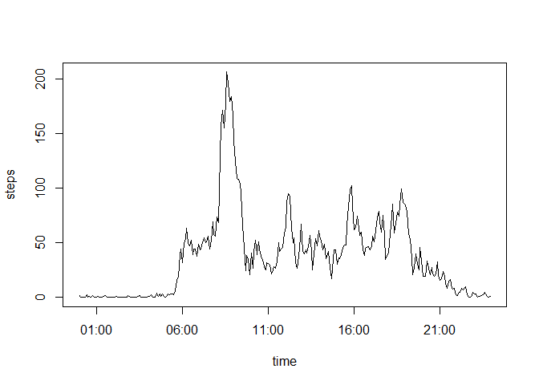
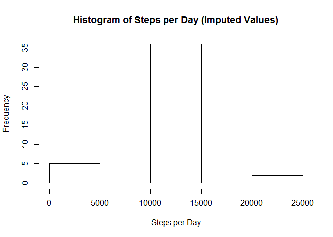
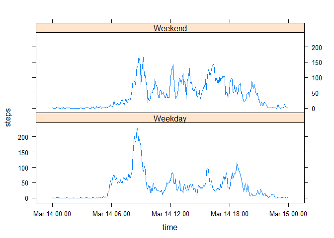

# Reproducible Research: Peer Assessment 1


## Loading and preprocessing the data
The first step of the analysis is to load the data:


```r
data <- read.csv("activity.csv")
```

The first column contains the number of steps taken in that five minutes, the second column contains the date (ranging from October 1 to November 30 2012), and the third column identifies the five-minute interval (ranging from 0 to 2355). We want to add another column combining the date and time information:


```r
dates <- as.POSIXct(data$date, format="%Y-%m-%d")
firstday <- dates[[1]]
lastday <- dates[[length(dates)]]
## Note we need through the last day, so we must add a day (24 hours * 60 min * 60 sec).
datetime <- seq.POSIXt(from = firstday, to = lastday+(24*60*60), by = "5 min")
## We get 2012-12-01 00:00:00 as the last entry, which we exclude
datetime <- head(datetime,-1)
data <- cbind(datetime, data)
```


## What is mean total number of steps taken per day?
Ignoring the missing values, we find the average number of steps taken per day. First we sum the steps taken in a day, then find the mean and median:


```r
data$day<-cut(data$datetime,breaks="day")
byday <- aggregate(steps ~ day, data, sum)
mean(byday$steps)
```

```
## [1] 10766.19
```

```r
median(byday$steps)
```

```
## [1] 10765
```

We also display this information in a histogram:


```r
hist(byday$steps, main = "Histogram of Steps per Day", xlab = "Steps per Day")
```

 


## What is the average daily activity pattern?
To see the pattern of steps over a day, we plot the number of steps per daily five-minute interval. To get the five-minute intevals, we create a column that contains a date-time object with the date fixed and times variable:


```r
times <- strftime(data$datetime, format="%H:%M:%S")
data$time <- as.POSIXct(times, format="%H:%M:%S")
```

With this solely time column, we can now aggregate the data by time and plot the average number of steps in each interval:


```r
byint <- aggregate(steps~time, data, mean)
plot(steps~time, byint, type="l")
```

 

Clearly there is a spike in activity in the morning. We find the five-minute interval that has the maximum average number of steps:


```r
byint[which.max(byint$steps),]
```

```
##                    time    steps
## 104 2015-03-14 08:35:00 206.1698
```

The interval with the most average steps is 8:35 a.m.

## Imputing missing values
The data set contains many missing values. We find exactly how many:


```r
sum(is.na(data$steps))
```

```
## [1] 2304
```

We want to impute these missing values. From the previous section, we see that the number of steps taken in any given interval varies throughout the day, so we will use the average number of steps in a five-minute interval to impute the missing values. Because only an integer number of steps makes physical sense, we round the average number to the nearest integer for imputation.


```r
data <- cbind(data, byint$steps)
names(data) <- c("datetime","steps","date","interval","day","time","IntervalAvg")
missing <- is.na(data$steps)
data$steps[missing] <- round(data$IntervalAvg[missing], digits = 0)
```

With all the values imputed, we can recalculate the mean and median:

```r
bydayImputed <- aggregate(steps ~ day, data, sum)
mean(bydayImputed$steps)
```

```
## [1] 10765.64
```

```r
median(bydayImputed$steps)
```

```
## [1] 10762
```

The histogram is also replotted:

```r
hist(bydayImputed$steps, main = "Histogram of Steps per Day (Imputed Values)", xlab = "Steps per Day")
```

 


## Are there differences in activity patterns between weekdays and weekends?
The last question to consider is the difference in steps taken on weekdays and weekend. First we must determine which days are weekdays and which are weekends:


```r
data$weekday <- weekdays(data$datetime)
data$weekday[data$weekday == "Saturday" | data$weekday == "Sunday"] <- "Weekend"
data$weekday[data$weekday != "Weekend"] <- "Weekday"
data$weekday <- as.factor(data$weekday)
```

With this data, we can now create plots comparing the average steps in each five-minute interval for both weekends and weekdays:


```r
byweekday <- aggregate(steps~time+weekday, data, mean)
library(lattice)
xyplot(steps ~ time| weekday, data = byweekday, type = "l", layout=c(1,2))
```

 

On the x-axis, the date (Mar 14) is simply the fixed date in the time variable; all that matters is the time value. From the plots, we can see that the subject is most active on the weekdays in the morning; perhaps they walk to work.

